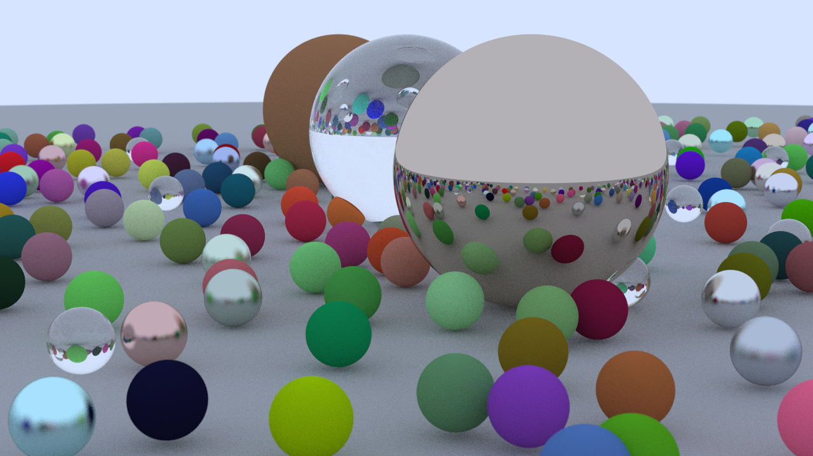
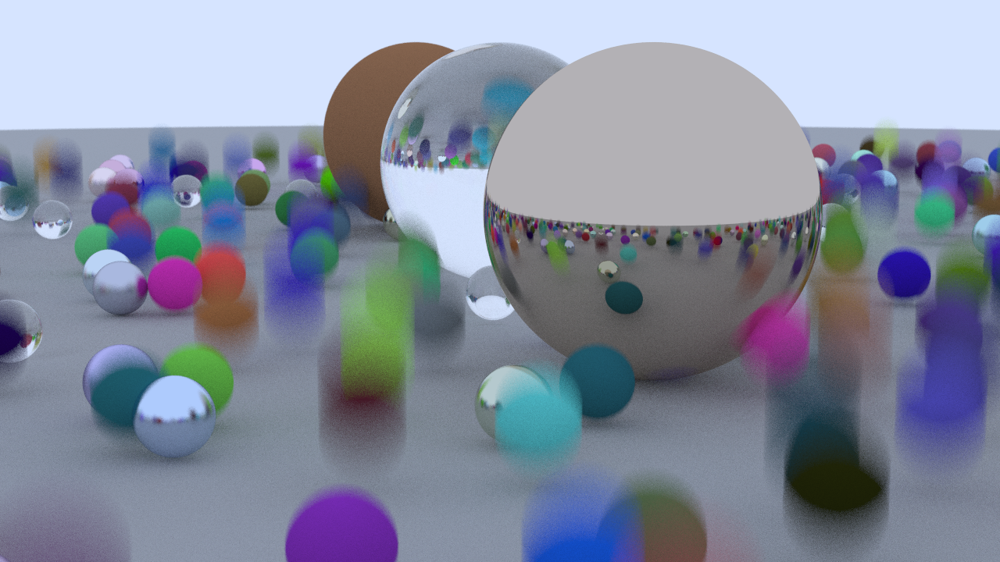
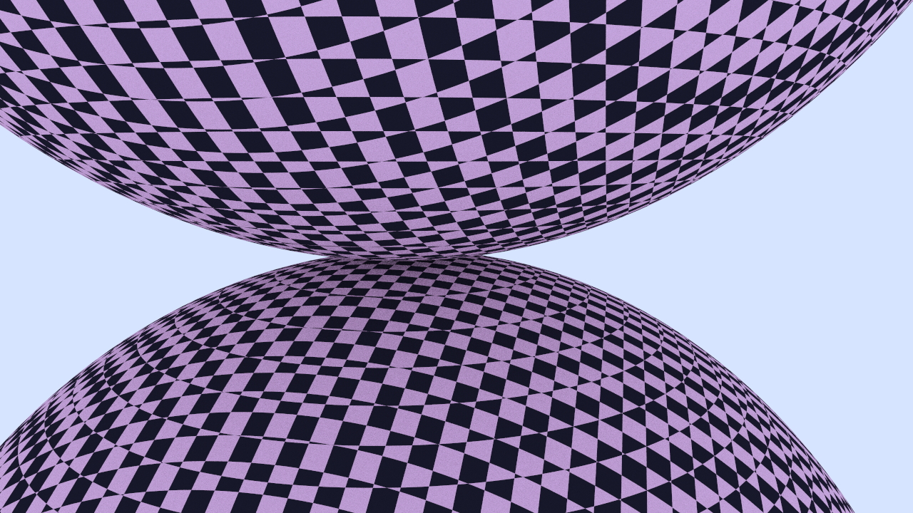

| <iframe src="https://player.vimeo.com/video/942603943" width="640" height="360" frameborder="0" allowfullscreen></iframe> |
| :-----------------------------------------------------------------------------------------------------------------------: |
|                                        _Animation demonstrating various features_                                         |
|                              `made by generating 720 frames and combining them with ffmpeg`                               |

|                      |
| :-------------------------------------------: |
| _Lambertian, Metallic and Dielectric Spheres_ |
|    `cargo run --release --example weekend`    |

|                |
| :----------------------------------------------: |
|                  _Motion Blur_                   |
| `cargo run --release --example bouncing_spheres` |

|                |
| :-------------------------------------: |
|            _Checker Texture_            |
| `cargo run --release --example checker` |

|                |
| :-------------------------------------------: |
|                _Image Texture_                |
| `cargo run --release --example image_mapping` |

|                |
| :------------------------------------------: |
|                _Simple Light_                |
| `cargo run --release --example simple_light` |

|                                      |
| :---------------------------------------------------------------: |
| _Cornell Box, 200 samples per pixel, Uniform Hemisphere Sampling_ |
|            `cargo run --release --example cornell_box`            |
